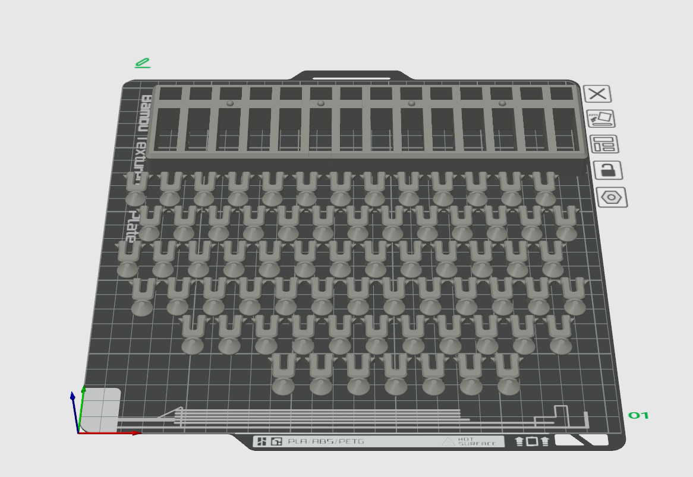
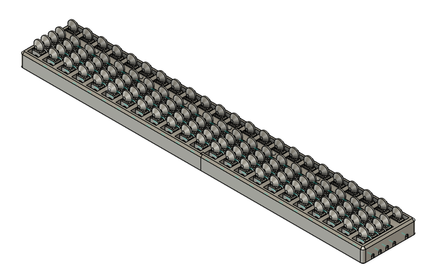

# OpenTactileAbacus

A 3D printable abacus designed for visually impaired users. Optimized for tactile operation, this design can be freely downloaded and printed by anyone. Perfect for educational use in schools and personal calculation practice.

[日本語版README](README_jp.md) | [Thingiverse](https://www.thingiverse.com/thing:7116846)

## Product Images

### 14-Digit Abacus



### 23-Digit Abacus



## Features

- **Tactile-Optimized Design**: Bead and frame design carefully crafted for fingertip operation by visually impaired users
- **3D Print Compatible**: Printable on standard 3D printers

## File Structure

```
├── README.md              # English README
├── README_jp.md           # Japanese README
└── files/
    ├── 3mf/
    │   ├── 14digits_abacus.3mf    # 14-digit abacus (3MF format)
    │   └── 23digits_abacus.3mf    # 23-digit abacus (3MF format)
    ├── autodesk_fusion/
    │   ├── 14digits_abacus.f3z    # 14-digit source file (Fusion 360)
    │   ├── 23digits_abacus.f3z    # 23-digit source file (Fusion 360)
    │   └── beads.f3d              # Bead source file (Fusion 360)
    └── stl/
        ├── 14digits_frame.stl     # 14-digit frame (STL format)
        ├── 23digits_frame_left.stl  # 23-digit frame left side (STL format)
        ├── 23digits_frame_right.stl # 23-digit frame right side (STL format)
        └── beads.stl              # Calculation beads (STL format)
```

## Available Models

### 14-Digit Abacus
- **Files**: 
  - `files/3mf/14digits_abacus.3mf` (Recommended for printing)
  - `files/stl/14digits_frame.stl` + `files/stl/beads.stl`

### 23-Digit Abacus
- **Assembly**: Requires adhesive assembly of frame parts
- **Files**: `files/3mf/23digits_abacus.3mf`

### Source Files
Fusion 360 source files provided for customization and improvement:
- `files/autodesk_fusion/14digits_abacus.f3z`
- `files/autodesk_fusion/23digits_abacus.f3z`
- `files/autodesk_fusion/beads.f3d`

## Print Specifications

### Tested Print Environment
- **3D Printer**: Bambu Lab X1 Carbon
- **Other Compatible Printers**: 
  - General FDM-type 3D printers with 0.4mm nozzle support
  - Must meet build size requirements

### Recommended File Format
- **3MF Files** (Recommended): Contains optimized print settings and supports for Bambu Lab printers
- **STL Files**: For users with other printers or custom slicer settings

### Recommended Settings
- **Layer Height**: 0.12mm
- **Infill**: 15-20%
- **Support**: 
  - Frame: May be required (check optimal placement in 3MF file)
  - **Beads (beads.stl): Support Required** - Support material needed due to hollow structure
- **Bead Print Orientation**: 
  - **Important**: Always print beads horizontally (axis hole horizontal)
  - Layer direction is crucial for snap-fit part strength
  - Vertical printing may cause snap-fit parts to break easily
- **Print Time**: 
  - 14-digit version: Approximately 12 hours
  - 23-digit version: Approximately 23 hours (5 plates)
- **Filament Usage**:
  - 14-digit version: Approximately 140g
  - 23-digit version: Approximately 235g

Print time and filament amounts are estimates when using Bambu Lab X1 Carbon.

- **Material**: PLA recommended (ABS, PETG also acceptable)

### Post-Processing
1. Carefully remove support material
2. Test bead movement on axes
3. If beads are tight, lightly sand the axis surfaces
4. Ensure smooth tactile operation for visually impaired users

## Assembly Instructions

### Using 3MF Files (Recommended)
1. Print complete model using provided 3MF files
2. Carefully remove support material from axis areas
3. Test bead movement - should slide smoothly but not too loosely
4. If beads are tight, lightly sand axis surfaces

### Using STL Files
1. Print frame (`14digits_frame.stl`) and beads (`beads.stl`) separately
   - **Note**: Always enable support material for bead printing
   - **Print Orientation**: Position beads horizontally (axis hole horizontal) to prevent snap-fit part damage
2. Print required number of beads based on abacus design:

   | Model | Required Beads | Breakdown |
   |-------|---------------|-----------|
   | 14-digit abacus | 70 beads | 5 beads per digit (1 top + 4 bottom) × 14 digits |
   | 23-digit abacus | 115 beads | 5 beads per digit (1 top + 4 bottom) × 23 digits |

3. Thread beads onto axes in correct pattern (4 bottom, 1 top per digit)
4. Test smooth operation and adjust as needed

### 23-Digit Version Assembly
The 23-digit abacus requires assembly of multiple frame parts:
1. Print all frame components
2. Join frame parts using appropriate adhesive (plastic adhesive or epoxy)
3. Allow sufficient curing time for adhesive
4. Pay attention to alignment during assembly for smooth bead movement

## Usage

### Basic Operation
1. Five-bead (top bead): 1 bead represents 5
2. One-bead (bottom beads): 1 bead represents 1 (4 beads maximum per digit)
3. Move beads with fingertips to represent and calculate numbers

## Contribution & Improvement

We welcome contributions to this project:

- **Issues**: Bug reports and improvement suggestions
- **Pull Requests**: Design improvements and documentation additions
- **Discussions**: Share usage experiences and educational implementation cases

## Support & Contact

- **Issues**: Please report questions and issues in the GitHub Issues tab
  - Example questions/reports:
    - Request for different size variations
    - Surface texture improvements for better tactile identification
    - Better assembly methods
    - Educational guide enhancements

- **Discussions**: Information exchange via GitHub Discussions
- **Email**: takumi1988okamoto@gmail.com

## Credits

This project was created to support education for visually impaired individuals and promote calculation learning.

We hope it contributes to creating a more accessible society.

## Related Links

- [Thingiverse Version](Link pending)
- [About Assistive Technology for Visually Impaired](Related link pending)

## License

This work is licensed under the Creative Commons Attribution 4.0 International License (CC BY 4.0).

© 2025 Takumi Okamoto

See the [LICENSE](LICENSE) file for details.
Please also read the [DISCLAIMER](DISCLAIMER.md) before use.

---

**We hope this project contributes even a little to the learning and daily life of visually impaired individuals.**
