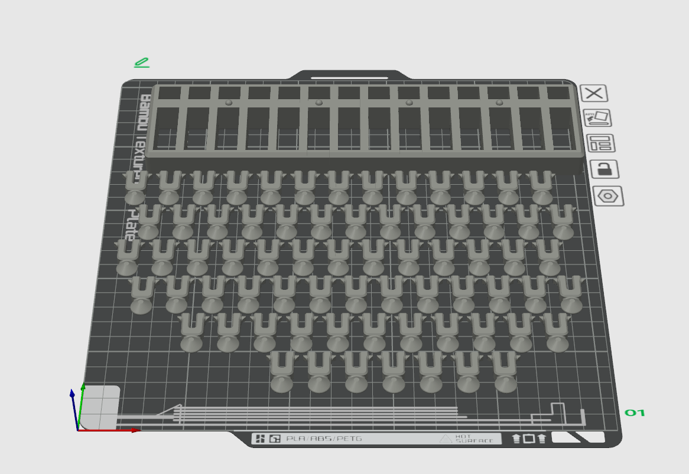
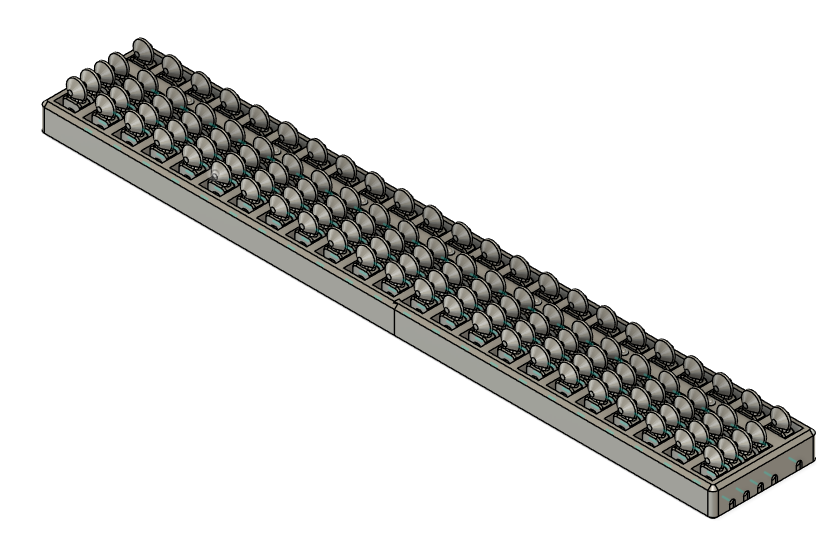
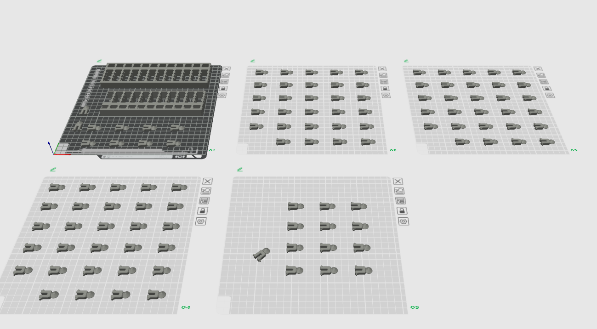

# OpenTactileAbacus

視覚障害者のための3Dプリント可能なそろばんです。触覚での操作に最適化された設計で、誰でも無料でダウンロード・印刷が可能。教育現場での計算学習や個人使用にお役立てください。

[English README](README.md) | [Thingiverse](https://www.thingiverse.com/thing:7116846) | [MakerWorld](https://makerworld.com/ja/models/1695604)

## 完成品画像

### 14桁そろばん



### 23桁そろばん



## 特徴

- **触覚最適化設計**: 視覚障害者の指先での操作に配慮した珠とフレーム設計
- **3Dプリント対応**: 一般的な3Dプリンターで印刷可能

## ファイル構成

```
├── README.md              # 英語版README
├── README_jp.md           # 日本語版README（このファイル）
└── files/
    ├── 3mf/
    │   ├── 14digits_abacus.3mf    # 14桁そろばん（3MF形式）
    │   └── 23digits_abacus.3mf    # 23桁そろばん（3MF形式）
    ├── autodesk_fusion/
    │   ├── 14digits_abacus.f3z    # 14桁ソースファイル（Fusion 360）
    │   ├── 23digits_abacus.f3z    # 23桁ソースファイル（Fusion 360）
    │   └── beads.f3d              # 珠ソースファイル（Fusion 360）
    └── stl/
        ├── 14digits_frame.stl     # 14桁フレーム（STL形式）
        ├── 23digits_frame_left.stl  # 23桁フレーム左側（STL形式）
        ├── 23digits_frame_right.stl # 23桁フレーム右側（STL形式）
        └── beads.stl              # 計算珠（STL形式）
```

## 利用可能なモデル

### 14桁そろばん
- **ファイル**: 
  - `files/3mf/14digits_abacus.3mf`（印刷推奨）
  - `files/stl/14digits_frame.stl` + `files/stl/beads.stl`

### 23桁そろばん
- **組み立て**: フレーム部分の接着剤による組み立てが必要
- **ファイル**: `files/3mf/23digits_abacus.3mf`

### ソースファイル
カスタマイズ・改良用のFusion 360ソースファイルを提供：
- `files/autodesk_fusion/14digits_abacus.f3z`
- `files/autodesk_fusion/23digits_abacus.f3z`
- `files/autodesk_fusion/beads.f3d`

## 印刷仕様

### 印刷確認環境
- **3Dプリンター**: Bambu Lab X1 Carbon
- **その他の対応プリンター**: 
  - 0.4mmノズル対応の一般的なFDM方式3Dプリンター
  - ビルドサイズが要件を満たすもの

### ファイル形式の推奨
- **3MFファイル**（推奨）: Bambu Lab プリンター向けに最適化された印刷設定とサポートを含む
- **STLファイル**: 他のプリンターまたはカスタムスライサー設定を使用したいユーザー向け

### 推奨設定
- **レイヤー高さ**: 0.12mm
- **充填率**: 15~20%
- **サポート**: 
  - フレーム: 必要な場合あり（3MFファイルで最適配置を確認）
  - **珠（beads.stl）: サポート必須** - 珠の方がスナップフィット部分よりも厚いため、印刷時にサポート材が必要
- **珠の印刷方向**: 
  - **重要**: 珠は必ず横向き（軸穴が水平）で印刷してください
  - スナップフィット部分の強度確保のため、層の方向が重要です
  - 縦向きで印刷するとスナップフィット部分が破損しやすくなります
- **印刷時間**: 
  - 14桁版: 約12時間
  - 23桁版: 約23時間 (5プレート)
- **フィラメント使用量**:
  - 14桁版: 約140g
  - 23桁版: 約235g

印刷時間とフィラメント量はBambu Lab X1 Carbon使用時の目安です。

- **材料**: PLA推奨（ABS、PETGも可）

### 印刷後処理
1. サポート材を慎重に除去
2. 軸上での珠の動作確認
3. 珠が固い場合は軸部分を軽く研磨
4. 視覚障害者が使いやすいスムーズな触覚操作を確保

## 組み立て方法

### 3MFファイル使用時（推奨）
1. 提供された3MFファイルを使用して完成モデルを印刷
2. 軸部分のサポート材を慎重に除去
3. 珠の動作テスト - スムーズに滑るが緩すぎないことを確認
4. 珠が固い場合は軸表面を軽く研磨

### STLファイル使用時
1. フレーム（`14digits_frame.stl`）と珠（`beads.stl`）を別々に印刷
   - **注意**: 珠の印刷には必ずサポート材を有効にしてください
   - **印刷方向**: 珠は横向き（軸穴が水平）で配置し、スナップフィット部分の破損を防いでください
2. そろばんの設計に基づいて珠を必要数印刷：

   | モデル | 必要な珠の数 | 内訳 |
   |--------|------------|------|
   | 14桁そろばん | 70個 | 各桁5個（上1個＋下4個）× 14桁 |
   | 23桁そろばん | 115個 | 各桁5個（上1個＋下4個）× 23桁 |

3. 正しいパターンで軸に珠を通す（下段4個、上段1個ずつ）
4. スムーズな動作確認と必要に応じて調整

### 23桁版の組み立て
23桁そろばんは複数のフレーム部分を組み立てる必要があります：
1. 全てのフレーム部品を印刷
2. 適切な接着剤（プラスチック用接着剤またはエポキシ）でフレーム部分を接合
3. 接着剤の硬化時間を十分に取る
4. 珠をスムーズに動かせるよう、組み立て時の位置合わせに注意

## 使用方法

### 基本操作
1. 五つ珠（上の珠）：1個で5を表す
2. 一つ珠（下の珠）：1個で1を表す（4個で最大4まで）
3. 指先で珠を動かして数を表現・計算

## 貢献・改良

このプロジェクトへの貢献を歓迎します：

- **Issues**: バグ報告や改善提案
- **Pull Requests**: 設計改良やドキュメント追加
- **Discussions**: 使用感想や教育現場での活用事例共有

## サポート・連絡先

- **Issues**: GitHub　Issuesタブで質問・報告くださるとうれしいです
  - 質問・報告例
    - 異なるサイズバリエーションが欲しい
    - 触覚識別を向上させる表面テクスチャ
    - より良い組み立て方法
    - 教育用ガイドの充実

- **Discussions**: GitHubのDiscussionsで情報交換
- **Email**: takumi1988okamoto@gmail.com

## クレジット

このプロジェクトは視覚障害者の教育支援と計算学習の普及を目的として作成されました。

より良いアクセシビリティ社会の実現にお役立てください。

## 関連リンク

- [Thingiverse版](https://www.thingiverse.com/thing:7116846)


## ライセンス

本作品は Creative Commons 表示 4.0 国際ライセンス（CC BY 4.0）の下に提供されます。

© 2025 Takumi Okamoto

詳細は [LICENSE](LICENSE) ファイルをご確認ください。
使用前に [免責事項](DISCLAIMER.md) もお読みください。

---

**このプロジェクトが視覚障害者の皆様の学習と生活に少しでも貢献できれば幸いです。**
