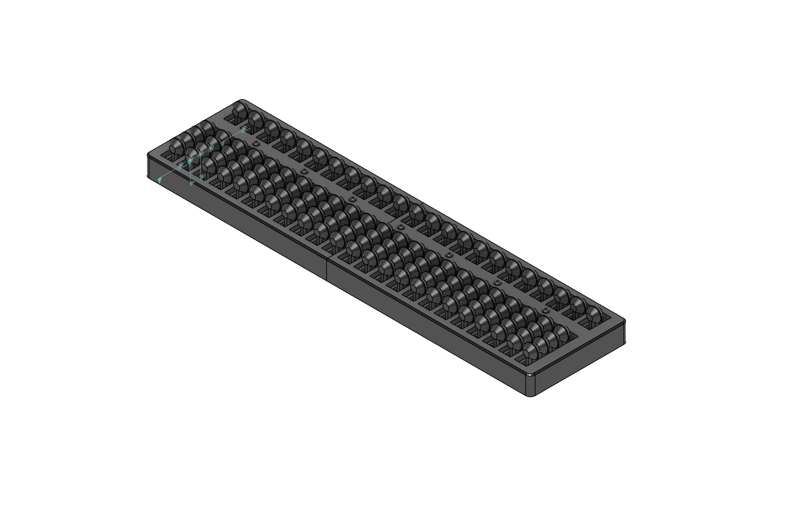
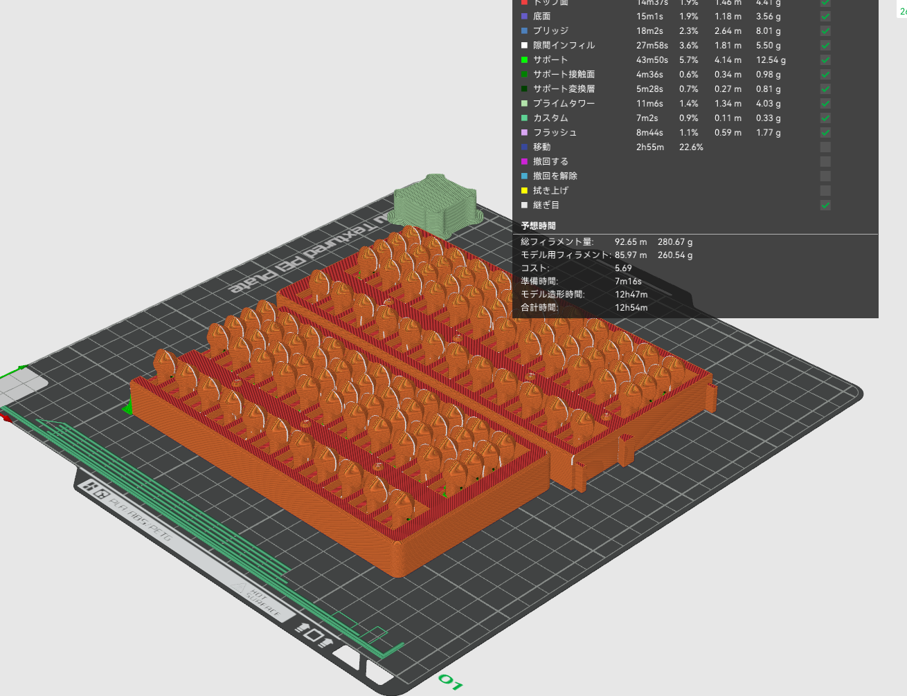
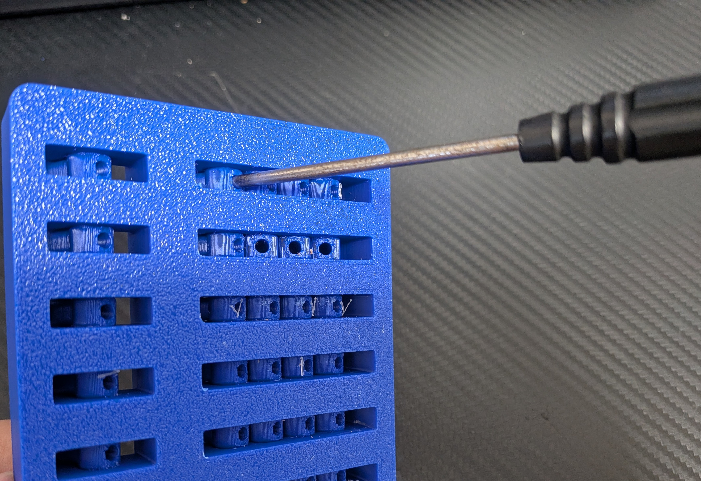

# OpenTactileAbacus

視覚障害者のための3Dプリント可能なそろばんです。

[English README](README.md) | [Thingiverse](https://www.thingiverse.com/thing:7402750) | [MakerWorld](https://makerworld.com/ja/models/3242916-opentactileabacus-ver-2026#profileId-3674481)

## 完成品画像

### 23桁そろばん



## 特徴

- **触覚最適化設計**: 視覚障害者の指先での操作に配慮した珠とフレーム設計
- **一体成型モデル**: フレームと珠を一体成型で印刷できるため、珠の取り付けは不要
- **分割フレーム**: 左右のフレームを印刷し、アリ溝を組み合わせて完成
- **3Dプリント対応**: 一般的な3Dプリンターで印刷可能

## ファイル構成

```
├── README.md              # 英語版README
├── README_jp.md           # 日本語版README（このファイル）
├── 3mf/
│   └── 23digits_abacus.3mf          # 23桁そろばん（3MF形式）
├── autodesk_fusion/
│   ├── 23digits_abacus.f3z          # ソースファイル（Fusion 360）
│   └── 23digits_abacus.step         # 交換用CADファイル（STEP形式）
└── stl/
    ├── 23digits_abacus_left.stl     # 23桁そろばん左側（STL形式）
    └── 23digits_abacus_right.stl    # 23桁そろばん右側（STL形式）
```

## 利用可能なモデル

### 23桁そろばん
- **3MFファイル（推奨）**: `3mf/23digits_abacus.3mf`
- **STLファイル**:
  - `stl/23digits_abacus_left.stl`
  - `stl/23digits_abacus_right.stl`

### ソースファイル
カスタマイズ・改良用のFusion 360ソースファイルを提供：
- `autodesk_fusion/23digits_abacus.f3z`
- `autodesk_fusion/23digits_abacus.step`

## 印刷仕様

### 印刷確認環境
- **3Dプリンター**: Bambu Lab X1 Carbon
- **その他の対応プリンター**: 
  - 0.4mmノズル対応の一般的なFDM方式3Dプリンター
  - ビルドサイズが要件を満たすもの

### ファイル形式の推奨
- **3MFファイル**（推奨）: Bambu Lab プリンター向けに最適化された印刷設定とサポートを含む
  - 収録プロファイルでは、サポート接触面用の第2フィラメントに **Bambu Support For PLA/PETG** を指定し、上面Z距離を `0 mm` に設定しています。第2フィラメントへ指定のサポート材を割り当て、AMSまたは同等のマルチマテリアル環境を使用してください
- **STLファイル**: 他のプリンターまたはカスタムスライサー設定を使用したいユーザー向け
  - **重要（Bambu Studio）**: **Slice gap closing radius**（設定キー: `slice_closing_radius`）を `0.02 mm` に設定してスライスしてください

### 推奨設定
- **レイヤー高さ**: 0.2mm
- **充填率**: 15～20%
- **サポート**: 必要な場合あり（3MFファイルの配置と設定を参照）
- **印刷時間**:
  - 23桁版: 約12時間（1プレート）
- **フィラメント使用量**:
  - 23桁版: 約280g
- **材料**: PLA推奨（ABS、PETGも可）

印刷時間とフィラメント量はBambu Lab X1 Carbon使用時の目安です。

### 印刷後処理
1. サポート材を慎重に除去
2. 刃先幅が約3mmのマイナスドライバーを珠の下部にある穴へ差し込み、珠を前後に数回動かして、プリント時の溶着を剥がす

   

3. 軸上での珠の動作確認
4. 珠が固い場合は、前後に繰り返し動かして摺動部をなじませる。それでも固い場合は軸部分を軽く研磨する
5. 視覚障害者が使いやすいスムーズな触覚操作を確保

> **注意**: ドライバーで部品や手を傷つけないよう、無理な力を加えず慎重に作業してください。

## 組み立て方法

### 3MFファイル使用時（推奨）
1. `3mf/23digits_abacus.3mf` をBambu Studioで開き、左右の部品を印刷する
2. 「印刷後処理」の手順に従い、サポート材を除去して珠を動作可能な状態にする
3. 左右の部品のアリ溝を組み合わせる
4. 全ての珠がスムーズに動くことを確認する

### STLファイル使用時
1. `stl/23digits_abacus_left.stl` と `stl/23digits_abacus_right.stl` をスライサーへ読み込む
2. Bambu Studioを使用する場合は、**Slice gap closing radius**（設定キー: `slice_closing_radius`）を `0.02 mm` に設定する
3. 適切な配置とサポートを設定し、左右の部品を印刷する
4. 「印刷後処理」の手順に従い、サポート材を除去して珠を動作可能な状態にする
5. 左右の部品のアリ溝を組み合わせる
6. 全ての珠がスムーズに動くことを確認し、必要に応じて調整する

## 使用方法

### 基本操作
1. 五つ珠（上の珠）：1個で5を表す
2. 一つ珠（下の珠）：1個で1を表す（4個で最大4まで）
3. 指先で珠を動かして数を表現・計算

## 貢献・改良

このプロジェクトへの貢献を歓迎します：

- **Issues**: バグ報告や改善提案
- **Pull Requests**: 設計改良やドキュメント追加
- **Discussions**: 使用感想や教育現場での活用事例共有

## サポート・連絡先

- **Issues**: GitHubのIssuesタブで質問・報告くださるとうれしいです
  - 質問・報告例
    - 異なるサイズバリエーションが欲しい
    - 触覚識別を向上させる表面テクスチャ
    - より良い組み立て方法
    - 教育用ガイドの充実

- **Discussions**: GitHubのDiscussionsで情報交換
- **Email**: takumi1988okamoto@gmail.com

## クレジット

このプロジェクトは視覚障害者の教育支援と計算学習の普及を目的として作成されました。

より良いアクセシビリティ社会の実現にお役立てください。

## 関連リンク

- [Thingiverse版](https://www.thingiverse.com/thing:7402750)
- [MakerWorld版](https://makerworld.com/ja/models/3242916-opentactileabacus-ver-2026#profileId-3674481)

## ライセンス

本作品は Creative Commons 表示 4.0 国際ライセンス（CC BY 4.0）の下に提供されます。

© 2025–2026 Takumi Okamoto

詳細は [LICENSE](LICENSE) ファイルをご確認ください。
使用前に [免責事項](DISCLAIMER.md) もお読みください。

---

**このプロジェクトが視覚障害者の皆様の学習と生活に少しでも貢献できれば幸いです。**
